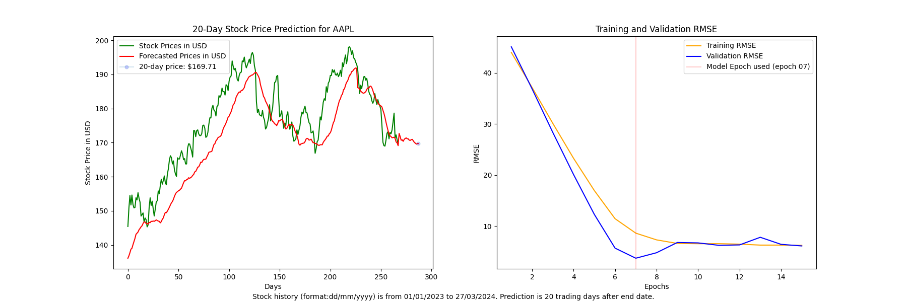
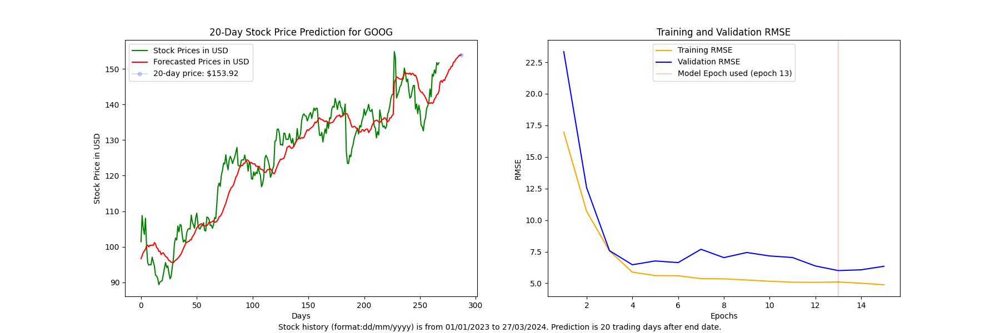

<!DOCTYPE html>

<html class="light" lang="en"><head>
<meta charset="utf-8"/>
<meta content="width=device-width, initial-scale=1.0" name="viewport"/>
<title>StockForecaster Dashboard</title>

<link href="https://fonts.googleapis.com/css2?family=Inter:wght@300;400;500;600;700&amp;display=swap" rel="stylesheet"/>
<link href="https://fonts.googleapis.com/css2?family=Material+Symbols+Outlined:wght@100..700,0..1&amp;display=swap" rel="stylesheet"/>
<link href="https://fonts.googleapis.com/css2?family=Material+Symbols+Outlined:wght,FILL@100..700,0..1&amp;display=swap" rel="stylesheet"/>

</head>
<body class="bg-background-light text-slate-800 font-display">

<!-- Top Navigation & Search -->
<header class="sticky top-0 z-20 bg-white/90 backdrop-blur-md px-4 pt-6 pb-4 border-b border-border-light">

monitoring

<h1 class="text-xl font-bold tracking-tight text-slate-900">StockForecaster</h1>

person

<label class="flex items-center h-12 w-full bg-slate-50 rounded-xl border border-slate-200 focus-within:border-primary focus-within:ring-1 focus-within:ring-primary/20 transition-all">
search
<input class="w-full bg-transparent border-none focus:ring-0 text-slate-900 placeholder:text-slate-400 text-sm" placeholder="Search tickers (AAPL, NVDA, TSLA...)" type="text"/>
mic
</label>

</header>
<main class="flex-1 px-4 pb-32 pt-6">
<!-- Prediction Status Card (Active Training) -->
<section class="mb-8">

<h2 class="text-xs font-bold uppercase tracking-widest text-slate-500">Prediction Status</h2>
LIVE

AAPL

<h3 class="text-lg font-bold text-slate-900">Apple Inc.</h3>

7-Day Price Forecast

Model Training in Progress...
65%

Estimated time remaining: ~2 mins

<button class="w-full py-3 bg-white hover:bg-slate-50 text-primary border border-primary/30 rounded-lg text-sm font-bold transition-all shadow-sm">
                                View Partial Analytics
                            </button>

</section>
<!-- Recent Predictions Section -->
<section class="mb-8">

<h2 class="text-xs font-bold uppercase tracking-widest text-slate-500">Recent Predictions</h2>
<a class="text-primary text-xs font-bold hover:underline" href="#">View History</a>

<!-- Prediction Item 1 -->

NVDA

Nvidia Corp

Predicted 4h ago

+4.2%

Confidence: 92%

<!-- Prediction Item 2 -->

TSLA

Tesla Inc

Predicted 12h ago

-1.8%

Confidence: 78%

</section>
<!-- Market Insights Section -->
<section>

<h2 class="text-xs font-bold uppercase tracking-widest text-slate-500">Market Insights</h2>
info

trending_up

Tech Sentiment

Bullish

speed

Volatility Index

Moderate

AI Insight

<h4 class="text-sm font-bold leading-tight mb-2 text-slate-900">Semi-conductor sector showing divergence from S&amp;P 500 benchmarks.</h4>

Deep-learning models suggest a potential breakout for mid-cap chips...

</section>
</main>
<!-- New Forecast FAB -->

<button class="flex items-center gap-2 px-6 py-4 bg-primary text-white rounded-full font-bold shadow-lg shadow-primary/30 hover:bg-slate-800 transition-all active:scale-95">
add_chart
New Forecast
</button>

<!-- Bottom Navigation Bar -->
<nav class="fixed bottom-0 left-0 right-0 z-40 border-t border-border-light bg-white px-4 pb-8 pt-3 shadow-[0_-4px_12px_rgba(0,0,0,0.03)]">

<a class="flex flex-col items-center gap-1 text-primary" href="#">
grid_view
Home
</a>
<a class="flex flex-col items-center gap-1 text-slate-400 hover:text-primary transition-colors" href="#">
analytics
Portfolio
</a>
<a class="flex flex-col items-center gap-1 text-slate-400 hover:text-primary transition-colors" href="#">
explore
Discover
</a>
<a class="flex flex-col items-center gap-1 text-slate-400 hover:text-primary transition-colors" href="#">
settings
Settings
</a>

</nav>

</body></html>
  

&nbsp;

## Description

StockForecaster is a full-stack stock price prediction platform that uses LSTM neural networks to forecast prices 20 days into the future. The project consists of a Python/TensorFlow backend deployed as a serverless AWS Lambda function, accessible via a public REST API with authentication and rate limiting, and a Next.js/TypeScript frontend deployed to Vercel.

The machine learning model leverages TensorFlow and Keras to format historic stock prices into time series data for training a Long Short-Term Memory (LSTM) network. The model works best with predictions spanning 20 days and stock history of at least 1 year. Training uses 15 epochs with 64 batches each, following best practices from scientific literature to prevent overfitting.

&nbsp;

## Technical Stack

#### Backend 
> Python 3.11, TensorFlow 2.15, AWS Lambda (Docker containerized), API Gateway, DynamoDB  

#### Frontend 
> Next.js 14, TypeScript, React, Tailwind CSS (deployed to Vercel)

#### ML Model
> LSTM with 50 units, 20% dropout, custom weighted RMSE epoch selection (75% validation, 25% training)

#### Features 
> Async request/response pattern, VADER sentiment analysis, cold start retry logic

&nbsp;

## API Endpoints

#### POST /predict
> Submit prediction request (returns request_id immediately)

#### GET /status/{request_id}
> Poll for completion and retrieve results

_Note_: Model training takes 1-2 minutes but uses async architecture to avoid API Gateway timeout limits.

&nbsp;

## Reproducible results: Confirmation samples with accuracy score

Confirmation results following update of model epoch scoring formula (75% weighting on validation data)

#### Disclaimer of Results
> Data has been heavily cherrypicked. Forecasting works best on stable stocks with greater than or equal to 6 months of historical data. All claims of MAPE and accuracy are backtesting accuracy results and are not indicators of future performance or future model accuracy.

&nbsp;
  
#### Apple (AAPL) Prediction (0.41% MAPE)
##### April 24, 2024 Model Prediction: $169.02 &nbsp; — &nbsp; April 24, 2024 Actual Price: $169.71

- Training and validation data spanning January 1, 2023 to March 27, 2024 (20 trading days before April 24)
- Model forecasted 20-day price accuracy: 99.59% (pre Q1-earnings)

&nbsp;

#### Disney (DIS) Prediction (1.75% MAPE)
##### April 24, 2024 Model Prediction: $113.92 &nbsp; — &nbsp; April 24, 2024 Actual Price: $111.93

- Training and validation data spanning January 1, 2023 to March 27, 2024 (20 trading days before April 24)
- Model forecasted 20-day price accuracy: 98.25% (post Q1-earnings)

&nbsp;

#### Oracle (ORCL) Prediction (6.98% MAPE)
##### April 24, 2024 Model Prediction: $115.34 &nbsp; — &nbsp; April 24, 2024 Actual Price: $123.39

- Training and validation data spanning January 1, 2023 to March 27, 2024 (20 trading days before April 24)
- Model forecasted 20-day price accuracy: 93.02% (post Q1-earnings)

&nbsp;

#### Alphabet/Google (GOOG) Prediction (4.46% MAPE)
##### April 24, 2024 Model Prediction: $161.10 &nbsp; — &nbsp; April 24, 2024 Actual Price: $153.92

- Training and validation data spanning January 1, 2023 to March 27, 2024 (20 trading days before April 24)
- Model forecasted 20-day price accuracy: 95.54% (pre Q1-earnings)

